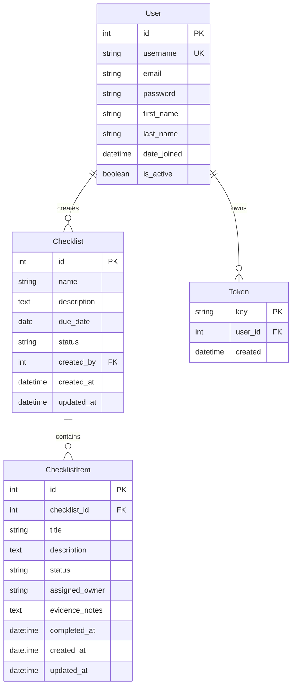

# Compliance Checklist Application

A full-stack GRC (Governance, Risk, and Compliance) application for managing compliance checklists with items, owners, and completion tracking.

## Tech Stack

**Backend**
- Python 3.11
- Django 4.2.7
- Django REST Framework 3.14.0
- drf-yasg 1.21.14 (Swagger/OpenAPI documentation)
- SQLite (development)

**Frontend**
- React 18.2.0
- Vite 5.0.8
- Tailwind CSS 3.3.6
- React Router DOM 6.20.0
- Axios 1.6.2

**DevOps**
- Docker
- Docker Compose
- Nginx (production frontend server)

## Features

- User authentication and authorization with token-based auth
- Create, edit, delete checklists
- Manage checklist items with status tracking
- Assign owners to checklist items
- Dashboard with compliance metrics and statistics
- Responsive design with Tailwind CSS
- RESTful API with proper error handling
- Swagger API documentation
- Layered architecture (Controller/Service/Repository)
- Three-layer input validation
- Dockerized deployment

## Project Structure

```
compliance-checklist/
├── backend/
│   ├── compliance_api/          # Main Django project
│   ├── checklists/              # Checklist app
│   │   ├── models.py            # Database models
│   │   ├── serializers.py       # DRF serializers
│   │   ├── views.py             # API controllers
│   │   ├── services.py          # Business logic layer
│   │   ├── repositories.py      # Data access layer
│   │   ├── exceptions.py        # Custom exceptions
│   │   └── urls.py              # URL routing
│   ├── users/                   # User management app
│   │   ├── models.py
│   │   ├── serializers.py
│   │   ├── views.py
│   │   ├── services.py
│   │   ├── repositories.py
│   │   └── urls.py
│   ├── manage.py
│   ├── requirements.txt
│   ├── Dockerfile
│   └── .dockerignore
├── frontend/
│   ├── src/
│   │   ├── components/          # Reusable components
│   │   │   └── Navbar.jsx
│   │   ├── pages/               # Page components
│   │   │   ├── Dashboard.jsx
│   │   │   ├── ChecklistList.jsx
│   │   │   ├── ChecklistDetail.jsx
│   │   │   ├── Login.jsx
│   │   │   └── Register.jsx
│   │   ├── context/             # React Context
│   │   │   └── AuthContext.jsx
│   │   ├── services/            # API services
│   │   │   └── api.js
│   │   ├── App.jsx
│   │   └── main.jsx
│   ├── package.json
│   ├── Dockerfile
│   ├── nginx.conf
│   └── .dockerignore
├── docker-compose.yml
├── API_DOCUMENTATION.md
├── DOCKER_SETUP.md
└── README.md
```

## Database Schema

The application uses a normalized relational database schema:



Relationships:
- One User creates many Checklists
- One Checklist contains many ChecklistItems
- Cascade delete: Deleting a User deletes their Checklists, deleting a Checklist deletes its Items

## Setup Instructions

You can set up the application in two ways:
1. Individual component setup (development)
2. Docker setup (recommended for demo/production)

### Option 1: Individual Component Setup

#### Prerequisites

- Python 3.11 or higher
- Node.js 18 or higher
- npm or yarn
- Git

#### Backend Setup

1. Navigate to backend directory
   ```bash
   cd backend
   ```

2. Create Python virtual environment
   ```bash
   python -m venv venv
   ```

3. Activate virtual environment
   
   On Windows:
   ```bash
   venv\Scripts\activate
   ```
   
   On macOS/Linux:
   ```bash
   source venv/bin/activate
   ```

4. Install dependencies
   ```bash
   pip install -r requirements.txt
   ```

5. Run database migrations
   ```bash
   python manage.py makemigrations
   python manage.py migrate
   ```

6. Create superuser account
   ```bash
   python manage.py createsuperuser
   ```
   Follow the prompts to set username, email, and password.

7. Start development server
   ```bash
   python manage.py runserver
   ```

8. Verify installation
   - API Base URL: http://localhost:8000
   - Swagger Documentation: http://localhost:8000/swagger/
   - Admin Panel: http://localhost:8000/admin/

#### Frontend Setup

1. Open a new terminal and navigate to frontend directory
   ```bash
   cd frontend
   ```

2. Install dependencies
   ```bash
   npm install
   ```

3. Start development server
   ```bash
   npm run dev
   ```

4. Verify installation
   - Application URL: http://localhost:5173
   - The frontend will automatically proxy API requests to http://localhost:8000

5. Access the application
   - Register a new user account
   - Login with your credentials
   - Start creating checklists

### Option 2: Docker Setup (Recommended)

#### Prerequisites

- Docker Desktop (Windows/Mac) or Docker Engine (Linux)
- Docker Compose

#### Quick Start

1. Navigate to project root directory
   ```bash
   cd Compliance_Checklist
   ```

2. Build and start containers
   ```bash
   docker-compose up -d --build
   ```

3. Wait for services to start (approximately 30-60 seconds)

4. Access the application
   - Frontend: http://localhost:3000
   - Backend API: http://localhost:8000
   - Swagger Docs: http://localhost:8000/swagger/

5. Create admin user (first time only)
   ```bash
   docker-compose exec backend python manage.py createsuperuser
   ```

#### Docker Management Commands

Stop containers:
```bash
docker-compose down
```

View logs:
```bash
docker-compose logs -f
```

View specific service logs:
```bash
docker-compose logs -f backend
docker-compose logs -f frontend
```

Restart services:
```bash
docker-compose restart
```

Rebuild after code changes:
```bash
docker-compose up -d --build
```

Access backend shell:
```bash
docker-compose exec backend python manage.py shell
```

Run migrations:
```bash
docker-compose exec backend python manage.py migrate
```

#### Docker Architecture

**Backend Container:**
- Base Image: python:3.11-slim
- Port: 8000
- Volume: SQLite database persisted in docker volume
- Auto-runs migrations on startup

**Frontend Container:**
- Build Stage: node:20 (builds React app)
- Serve Stage: nginx:alpine (serves static files)
- Port: 3000
- Configured with gzip compression and React Router support


## License

MIT License
